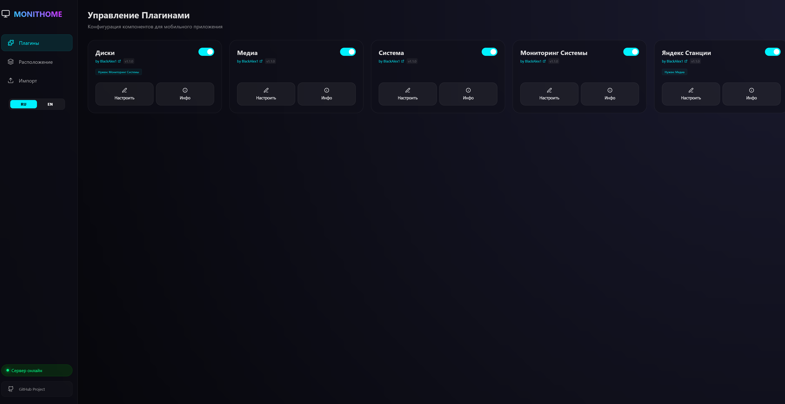
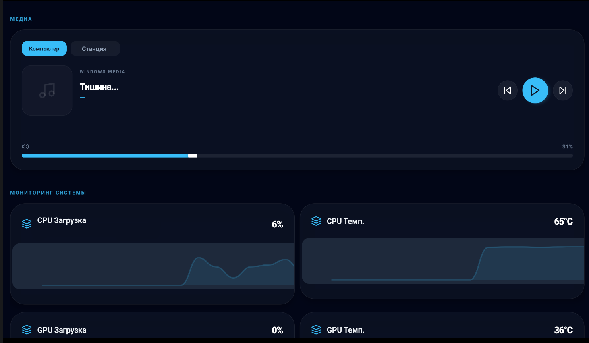
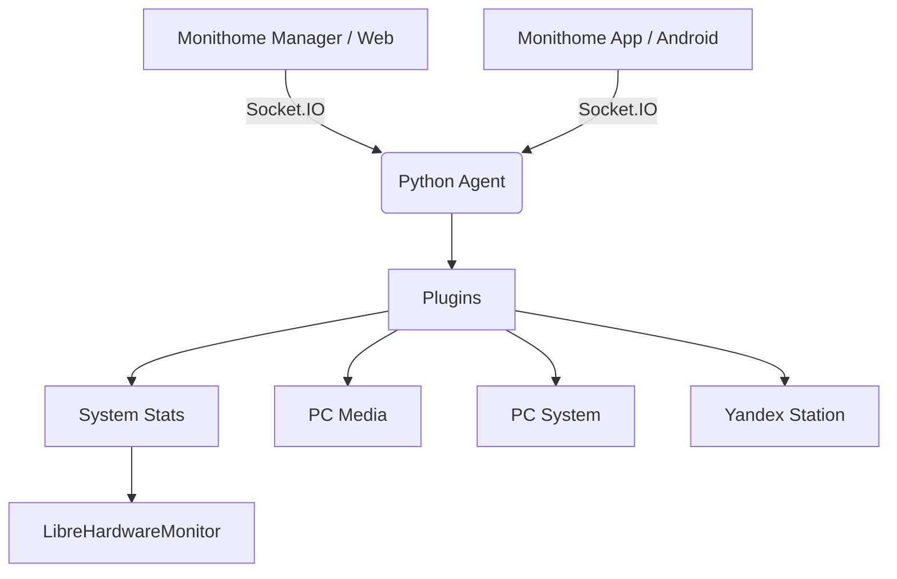

# 🚀 Monithome

<p align="center">
  
  
  
  
</p>

---

**Monithome** — это современная экосистема для глубокого мониторинга вашего ПК и управления умным домом. Проект объединяет в себе мощный Python-агент для сбора данных и стильный кроссплатформенный дашборд на React / React Native.

> [!TIP]
> Идеально подходит для использования на старом планшете в качестве внешнего дисплея состояния системы или пульта управления умным домом.

---

## 📸 Скриншоты

<p align="center">
  
</p>

<p align="center">
  
</p>

---

## 🌟 Основные возможности

### 💻 Продвинутый мониторинг ПК
*   **Real-time графики**: Отслеживание CPU, GPU, RAM и температур с минимальной задержкой.
*   **Низкоуровневый доступ**: Интеграция с **LibreHardwareMonitor** и **MSI Afterburner** для получения самых точных данных.
*   **Дисковая подсистема**: Мониторинг свободного места на всех накопителях с поддержкой выбора конкретных дисков.
*   **Power Management**: Дистанционное управление питанием (сон, выключение, перезагрузка, блокировка) с подтверждением действий.

### 🏠 Умный дом и Медиацентр
*   **Яндекс Станция**: Управляйте музыкой и отправляйте текстовые команды Алисе прямо с планшета.
*   **Unified Media**: Единый центр управления громкостью и плеерами ПК прямо с планшета.
*   **Плагинная система**: Легко добавляйте новый функционал или отключайте ненужные модули через встроенный менеджер.

---

## 🛠 Технологический стек



*   **Backend**: Python, Flask, Socket.IO, Psutil, WMI.
*   **Web Manager**: Vite, React, TypeScript, Framer Motion, Lucide.
*   **Mobile Client**: React Native, Expo, Socket.IO Client.

---

## 🚀 Быстрый старт

### 1. Сервер (ПК)
1. Установите Python 3.8+.
2. Перейдите в папку `pc/`:
   ```bash
   python -m venv venv
   venv\Scripts\activate
   pip install -r requirements.txt
   python pc_agent.py
   ```
*Сервер автоматически запросит права администратора для доступа к датчикам.*

### 2. Менеджер (Web)
1. Перейдите в `pc_gui/`:
   ```bash
   npm install
   npm run build
   ```
*Собранный интерфейс будет доступен по адресу `http://localhost:5000` при запущенном агенте.*

### 3. Планшет / Смартфон (Android)
1. Установите приложение **Expo Go** на ваше устройство.
2. Перейдите в `android/`:
   ```bash
   npm install
   npx expo start --clear
   ```
3. Введите локальный IP вашего ПК.
---

<p align="center">
  <sub>Made with ❤️ for better hardware control</sub>
</p>
