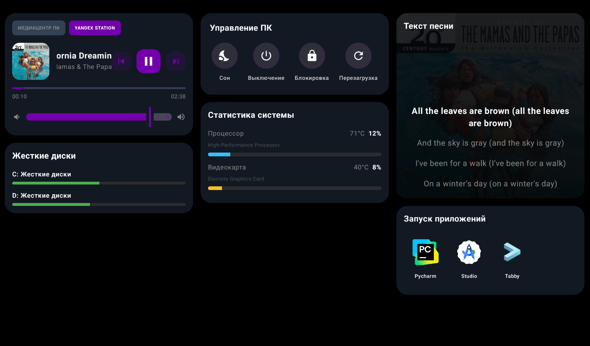

# 🚀 Monithome v2

  
  
  
  

---

**Monithome** — это удобное приложение для глубокого мониторинга вашего ПК и удаленного управления медиа прямо с планшета или смартфона.

## 📸 Скриншоты

  

  

---

## 🌟 Основные возможности

### 💻 Мониторинг и Управление ПК
*   **System Stats**: Мониторинг CPU и GPU.
*   **App Launcher**: Хотбар для быстрого запуска приложений на ПК.
*   **Power Control**: Блокировка, сон, перезагрузка и выключение прямо с дашборда.
*   **Disk Explorer**: Быстрый просмотр состояния всех накопителей.

### 🎵 Медиа и Интеграции
*   **Yandex Station**: контроль Яндекс Станций, просмотр текущего трека и управление воспроизведением.
*   **Lyrics**: Синхронизированный вывод текста песен в реальном времени.
*   **PC Media**: Управление системной громкостью и плеерами Windows.

---

